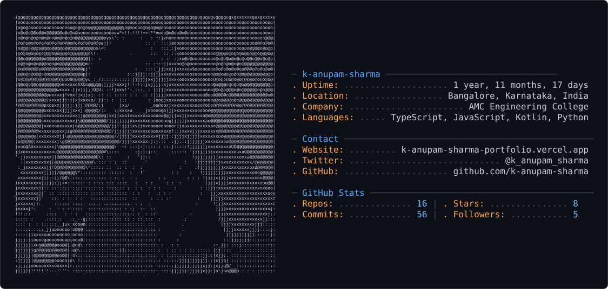

# Hi — I'm Anupam 👋🏼

I build products that combine AI, computer vision and mobile/AR to solve real-world problems. My projects range from assistive tech for the visually impaired and AR medical guidance, to Android apps and web platforms for campus networking, SME growth, inventory management and developer tooling.

I enjoy turning research-grade models into reliable, deployable systems — shipping end-to-end solutions with social impact.

## Experienced in

- **Languages:** JavaScript/TypeScript, Kotlin, Python, C, C++, Java, HTML  
- **Computer vision & ML:** YOLOv8‑Nano, OpenCV DNN SSD, MTCNN, MobileFaceNet (ONNX), FaceNet / InceptionResnetV1, Tesseract OCR  
- **Deployment & tooling:** ONNX, Blender, AR, Android, Raspberry Pi 4  
- **Systems & platforms:** OpenStreetMap, knowledge graphs, Entire Graph, MCP, Hindsight  
- **Research & architectures:** multi‑agent AI, digital‑twin biometrics, AI Flight Recorder, AI Blackbox, AI Courtroom for AI Flight Recorder

Feel free to explore my repos or reach out — I'm always open to collaboration and interesting problems to solve.
